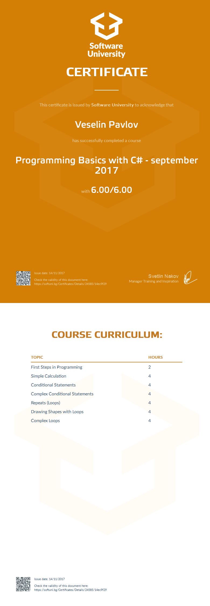

# Course: Programming Basics with C#

## Topics:
```
01. First Steps in Coding
02. Simple Calculations
03. Simple Conditional Statements
04. Complex Conditional Statements
05. Simple Loops
06. Drawing Figures with Loops
07. Advanced Loops
```

## Status:
Completed

## Certificate:

